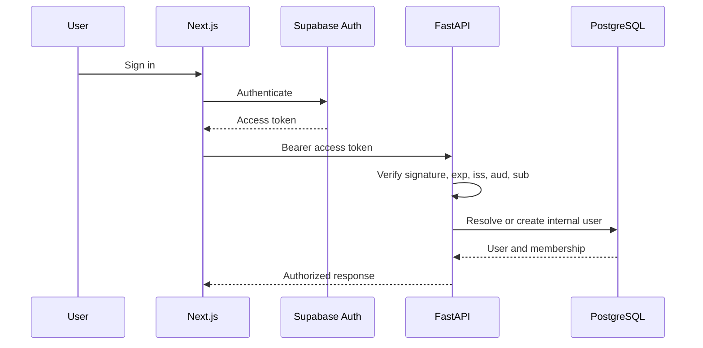

# Authentication flow

FastAPI accepts asymmetric Supabase JWKS through `SUPABASE_JWKS_URL`, with cached keys and rotation refresh, or the legacy shared `SUPABASE_JWT_SECRET`. JWKS is preferred. Internal users are synchronized on the first authenticated request. `/auth/logout` confirms the backend operation only; the frontend must call Supabase sign-out because Phase 1 does not revoke tokens server-side.

`SUPABASE_PUBLISHABLE_KEY` and `SUPABASE_SECRET_KEY` are the preferred backend
names. `SUPABASE_ANON_KEY` and `SUPABASE_SERVICE_ROLE_KEY` remain temporary
compatibility aliases. Modern names take precedence, and startup fails without
revealing values if both aliases are configured differently. Frontend builds
use `NEXT_PUBLIC_SUPABASE_PUBLISHABLE_KEY`; privileged keys are rejected.

When `SUPABASE_JWT_ISSUER` or `SUPABASE_JWKS_URL` is omitted, it is derived from
the normalized `SUPABASE_URL`. JWT signature verification is never disabled as
a fallback for an unavailable JWKS endpoint.
