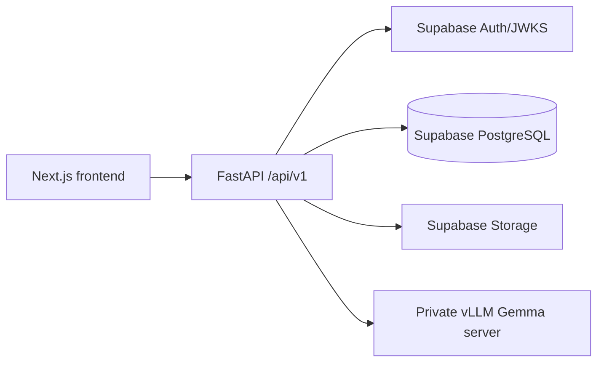

# Backend architecture

`api/v1` owns stable product routes. `auth` verifies identity and classroom permissions. `core` owns configuration, request context, errors, middleware, and logging. `repositories` encapsulate asynchronous database access. `schemas` define public contracts. `services` own model and domain orchestration. Health routes deliberately remain outside `/api/v1`.

Local API: `uvicorn app.main:app --app-dir backend`. Apply SQL migrations in `backend/database/migrations/` in filename order before traffic.
